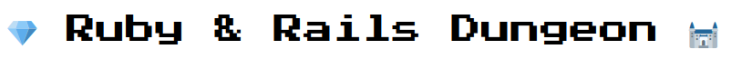
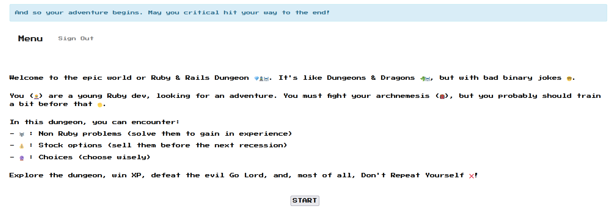
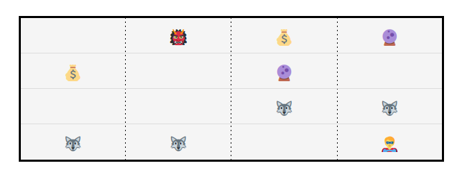
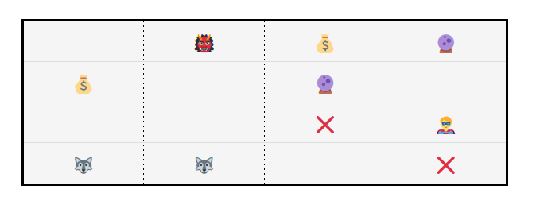
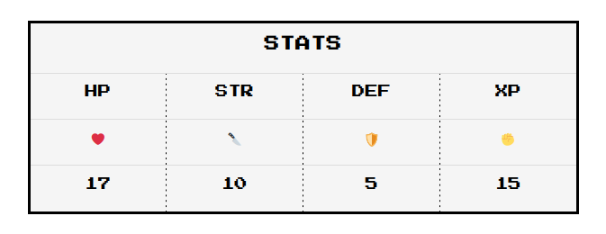
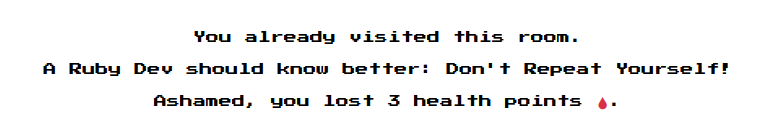
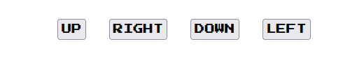
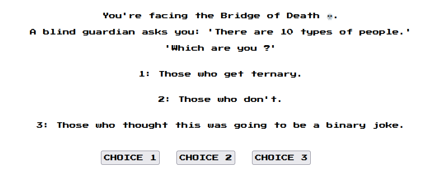
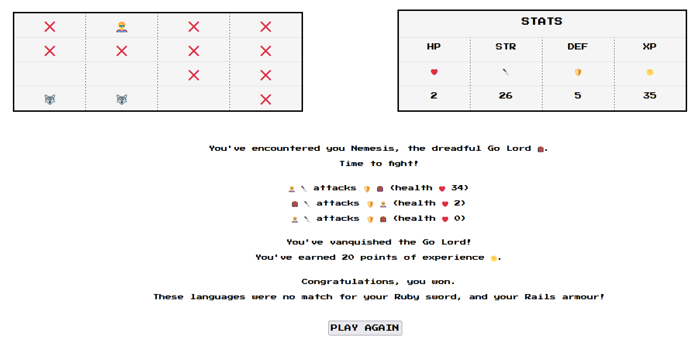
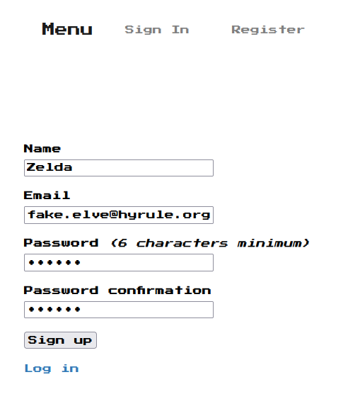

<span style="background-color: green">
  <p align="center">
    
  </p>

  # Ruby & Rails Dungeon App

  This [application](https://ruby-rails-dungeon-app.herokuapp.com/) is a tribute to old school hack and slash dungeon crawler video games.

  Its goal is to provide players with a fun and fast game, but, most of all to challenge myself, and learn Rails the hard way. It's a Rails adaptation of RPG Command Line Interface games, with a full database, registered users, and several models, each with their unique attributes and specificities.

  <p align="center">
    
  </p>
  <br><br>
  ## How To Play

  The game start with a title card that explains the rules.

  <p align="center">
    
  </p>
  <br>

  Once you click START, you access the game screen, with several elements.

  You'll play on the **board**, which is a 4 x 4 table. It is generated from the room objects every time the page is actualized, either through a request (that modifies it) or a classic refresh.

  <p align="center">
    
  </p>
  <br>

  As you move, encounters will take place then their icon will disappear. Every room the hero has visited will be marked as "visited" through an attribute, and will have a red cross icon. Going to an already visited room will have consequences (see message bellow).

  <p align="center">
    
  </p>
  <br>

  Next to the board are the hero's **stats**, that will evolve through the games. Once you reach 0 health points, you die.

  <p align="center">
    
  </p>
  <br>

  Below the board and stats tables, are the game messages. They are created through messages objects, that are related to a specific game. Once a message has been output, and the player has chosen his next action (move or choice), it will be automatically deleted.

  <p align="center">
    
  </p>
  <br>

  The user interacts with the game thanks to form buttons, that transmit their choices and moves to the game controller. 

  Depending on the board position and adjacent walls, the player  can choose between 2 to 4 [directions](https://github.com/hgodinot/ruby_rails_dungeon/blob/main/app/views/games/_commands.html.erb).

  <p align="center">
    
  </p>
  <br>

  [Choices](https://github.com/hgodinot/ruby_rails_dungeon/blob/main/app/views/games/_choices.html.erb) are a specific kind of encounter. They involve 3 propositions, and some bad dev jokes.

  <p align="center">
    
  </p>
  <br>

  I used a custom class for all elements of the game, giving them access to both the retro gaming [Press Start 2P](https://fonts.google.com/specimen/Press+Start+2P) font, and fade-in transition animation.

  The game will end if you defeat the boss, or die at any point. Be it a victory or a defeat, you can then choose to play again. It will automatically delete the current game, and either redirect you to the home page if you've got other saved games, or create and start a new game for you if you don't.

  <p align="center">
    
  </p>
  <br><br>

  ## Tech Stack

  I developed this app in Ruby, as I’ve spent the past year learning programming mainly through this language. I always loved Ruby's object-oriented design, and that's what I used there, but with a twist: I used Rails as a framework, and chose to work with registered users through the [Devise gem](https://github.com/heartcombo/devise), and a  [database](https://github.com/hgodinot/ruby_rails_dungeon/blob/main/db/schema.rb).

  <br>

  The game is hosted on an EU server by Heroku, so US users might have some latency.

  <br>

  This game being mostly a toy app, I disabled devise email verifications and confirmations. So, you can use a fake email for the account creation, as long as it looks like a legit one.

  <p align="center">
    
  </p>
  <br><br>

  ## Setting it up on your own machine

  You can play the [online version](https://ruby-rails-dungeon-app.herokuapp.com/) hosted by Heroku, or run the game locally.

  *Note: You'll need to have `ruby` version `2.7.4` and `rails` version `6.1.4.1` installed on your computer.*

  Clone the repository:

  ```unix
  git clone https://github.com/hgodinot/ruby_rails_dungeon.git
  ```

  Install the required gems:

  ```unix
  bundle install
  ```

  Run the app locally (on `localhost:4567`) with the following command:

  ```unix
  rails server
  ```

  Run the tests suite:

  ```unix
  rails test
  ```

  Enjoy the game!
  <br><br>

  ## Credit

  This project is the work of [Hervé Godinot](https://www.linkedin.com/in/hervegodinot/)
</span>